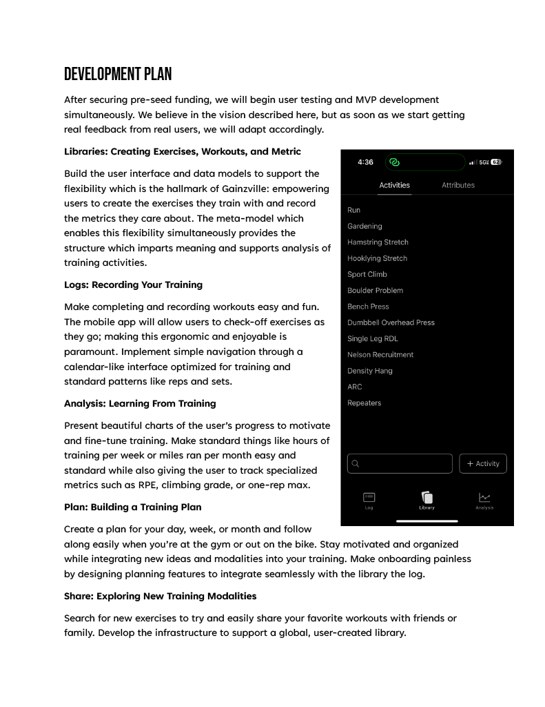
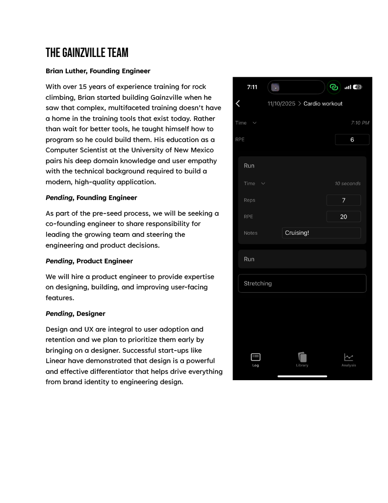
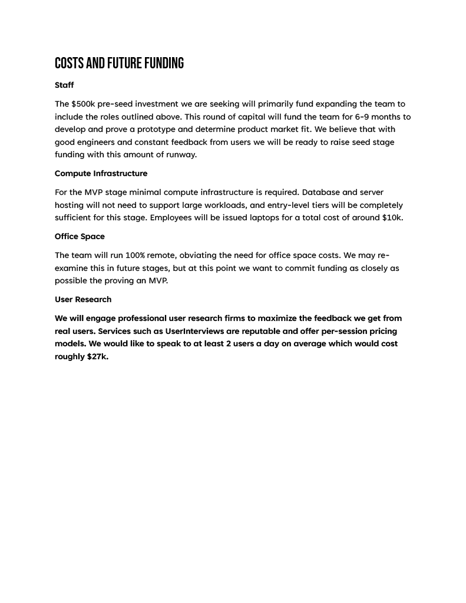
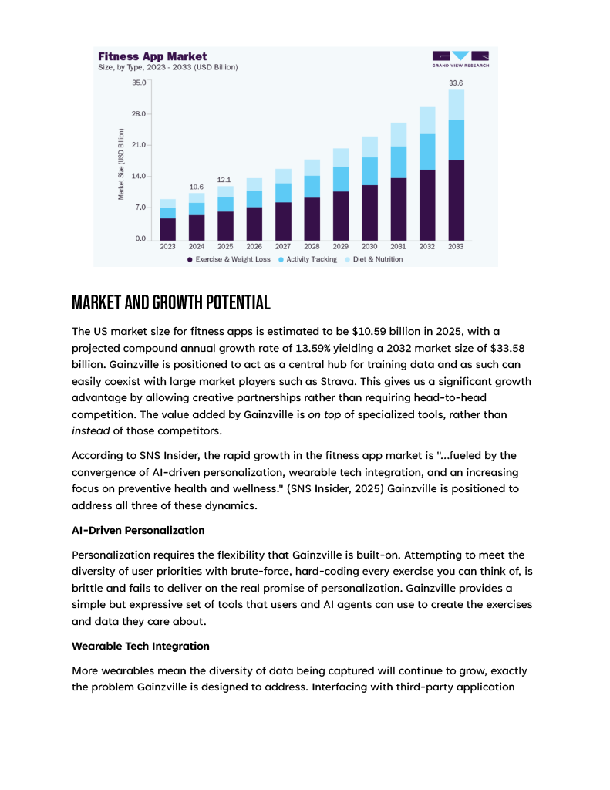
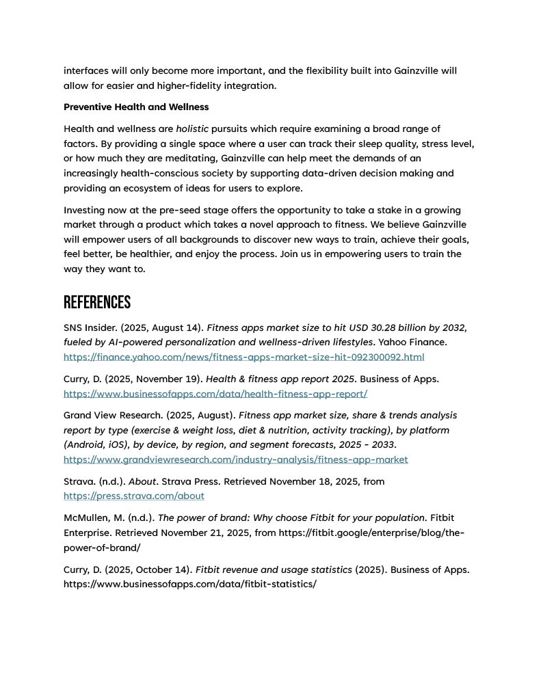

import { YouTube } from 'astro-embed'

The following is a proposal to raise investment for a fitness app called Gainzville.

<YouTube id="https://youtu.be/9dDwaPCmAnY?si=jIn2ki8POwtAvHxr" />

The proposal can be downloaded as a pdf <a href="/project3-proposal-final.pdf" download="gainzvile-proposal.pdf">here</a>.

### Reflection

The purpose of this project is to secure pre-seed investment for a business to build a fitness app called Gainzville. The proposal addresses the objectives of the app, the development roadmap for building the app, the features of the app, the team that will be assembled using the funding, the costs associated with the project, as well as the market and growth potential. I provided evidence that there is a large and growing market for fitness apps and connected the dynamics of that growth to the features of the app that are positioned to take advantage of those growth dynamics. By including image and video prototypes of the app, I provided potential investors with a clear picture of how the app will provide the functionality and user experience that I propose.

The audience for my proposal and presentation are potential investors, primarily venture capitalists. To speak to this audience, I researched the phases of venture capital funding and fit them to the app I am proposing. I identified that the app is at the so-called "pre-seed" stage and that start-ups at this stage should prioritize building a minimum viable product (MVP) and getting user feedback. I chose a slide presentation because this is a familiar format in the tech industry and it allowed me to present the visual appearance and design of the app. The slide presentation also allowed me to include my own personality and passion for the project by narrating the proposal in my own voice.

Gainzville is a real app I've been working on for five years! This project was a fun and instructive opportunity to try to encapsulate the core idea of the app and begin thinking about the market viability from the perspective of an investor. I chose to keep the development plan relatively high-level by describing the features which I would prioritize for the MVP stage of the project. I think delving too far into the technical details (client/server architecture, technology stack, data model, etc.) would have been inappropriate and infeasible for this type of presentation. My research on venture capital also indicated that it is typical for pre-seed stage companies to iterate rapidly in response to user feedback as opposed to outlining in detail every step of the development. This project was a great forcing function to get me to formalize my ideas and I was excited to have the freedom to apply some of my time in the class to something personally meaningful.